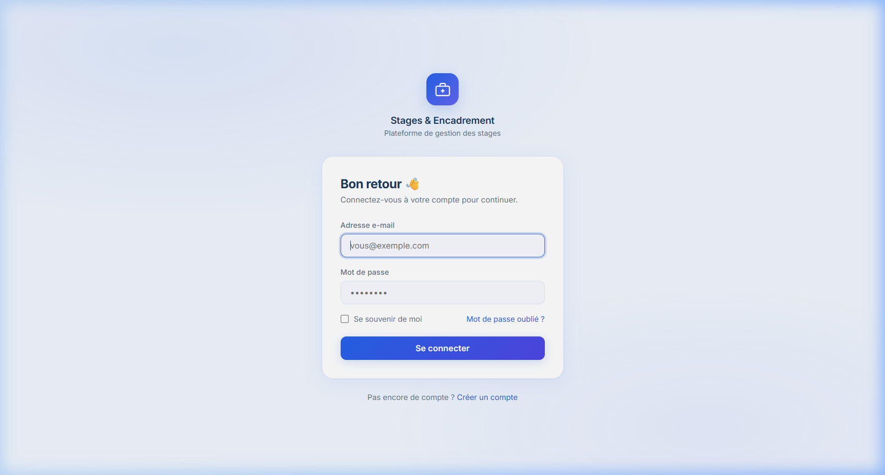
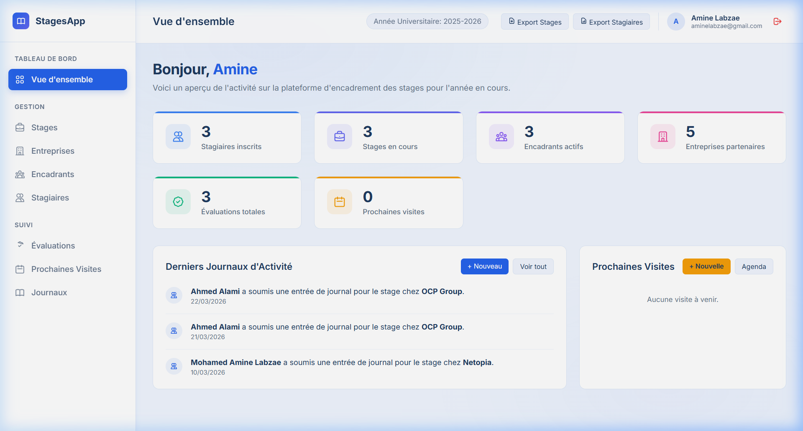
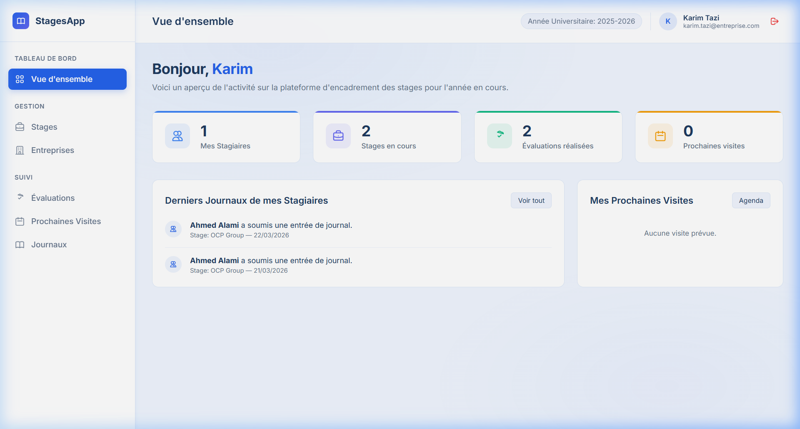
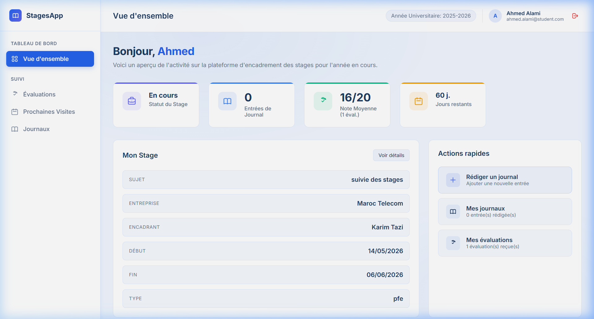

# 🎓 Plateforme Web de Gestion de Stages et Encadrement

Une application web moderne pour gérer les stages, le suivi des stagiaires, les entreprises et les évaluations avec des fonctionnalités avancées d'export et de tableau de bord.
Développé pour l'optimisation du processus de suivi et d'encadrement des stages.

<div align="center">
  
</div>

---

## 🌟 Aperçu du Projet
Ce projet a été conçu pour simplifier et digitaliser le processus d'encadrement des stagiaires au sein d'une organisation. Grâce à une interface intuitive et des rôles bien définis, les différents acteurs (Administrateurs, Encadrants et Stagiaires) peuvent interagir efficacement et suivre l'avancement des stages en temps réel.

## 📸 Tableaux de Bord

### Interface Administrateur


### Interface Encadrant


### Interface Stagiaire


## ✨ Fonctionnalités Clés

🏠 **Tableaux de Bord Dynamiques et Rôle-spécifiques :**
- **Stagiaires :** Suivi de leur stage en cours, jours restants, notes d'évaluation, et statistiques de jour.
- **Encadrants :** Vue d'ensemble sur les stagiaires assignés, stages actifs, visites à venir, et journaux récents.
- **Administrateurs :** Statistiques globales du système (nombre total de stages, entreprises, visites prévues).

👥 **Gestion Complète (CRUD) :**
- Stagiaires & Encadrants
- Entreprises d'accueil
- Stages (Sujet, Dates, Types)

📝 **Suivi Continu :**
- **Journaux de Stage :** Les stagiaires peuvent remplir leurs avancées régulières.
- **Visites d'Évaluation :** Planification et suivi de visites sur site par les encadrants.
- **Évaluations :** Saisie des notes et commentaires.

📄 **Exports et Imports Avancés :**
- Génération de PDFs (Attestations de stage, Rapports d'évaluation).
- Import et Export en masse vers/depuis Excel pour les Stagiaires, Stages et Entreprises.

## 🛠️ Stack Technologique
- **Backend:** Laravel 11.x (PHP 8.2+)
- **Frontend:** Blade Templating, Tailwind CSS, Vite
- **Base de Données:** MySQL / MariaDB (ou PostgreSQL)
- **Authentification:** Laravel Breeze
- **Outils Tiers:** DomPDF (pour exports PDF), Laravel Excel (pour imports/exports Excel)

## 🚀 Installation & Lancement Rapide

Suivez ces étapes pour exécuter le projet localement :

1. **Cloner le dépôt**
```bash
git clone https://github.com/aminelabzae/Academic-Management-Web-Application.git
cd Academic-Management-Web-Application
```

2. **Installer les dépendances Backend**
```bash
composer install
```

3. **Installer les dépendances Frontend**
```bash
npm install
```

4. **Configurer l'environnement**
Copiez le fichier d'environnement et générez une clé d'application :
```bash
cp .env.example .env
php artisan key:generate
```
*(N'oubliez pas de configurer les informations d'accès à votre base de données dans le fichier `.env`.)*

5. **Exécuter les Migrations et Seeders**
```bash
php artisan migrate --seed
```

6. **Lancer le serveur de développement**
Ouvrez deux terminaux séparés et exécutez ces commandes :
```bash
php artisan serve
```
```bash
npm run dev
```

7. **Accéder à l'application**
Rendez-vous sur [http://localhost:8000](http://localhost:8000)

## 🔒 Règles de Contribution
- Les fichiers d'environnement (`.env`) et autres fichiers temporaires doivent rester non-suivis dans Git.
- Les dépendances `/vendor` et `/node_modules` sont inclues dans `.gitignore`.
